# 동국대학교 대관 신청 웹 시스템

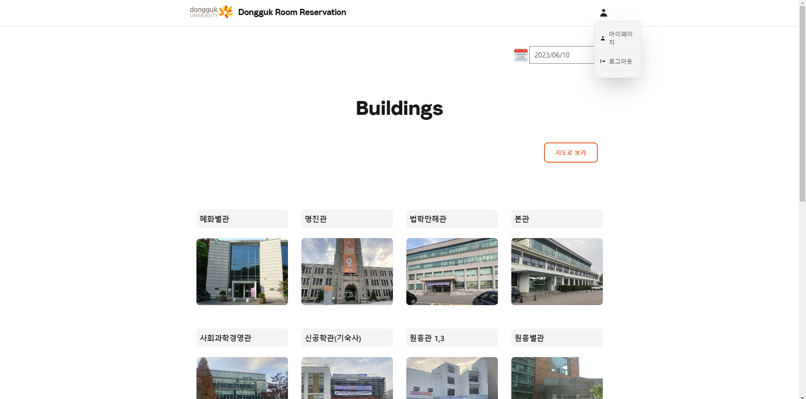

<br>

## Developed by CSID-DGU: 5-Prodigy_Project
### React 기반의 동국대학교 대관신청 웹 시스템
<br>

  <br>

<br>

# Table of content
- [주요 기능들](#주요-기능들)
- [Team members](#team-members)
- [프로젝트 실행 모습](#프로젝트-실행-모습)
- [프로젝트 구조](#project-structure)
- [How to run](#how-to-run)
- [References](#references)

<br>

# 주요 기능들
- **회원가입**

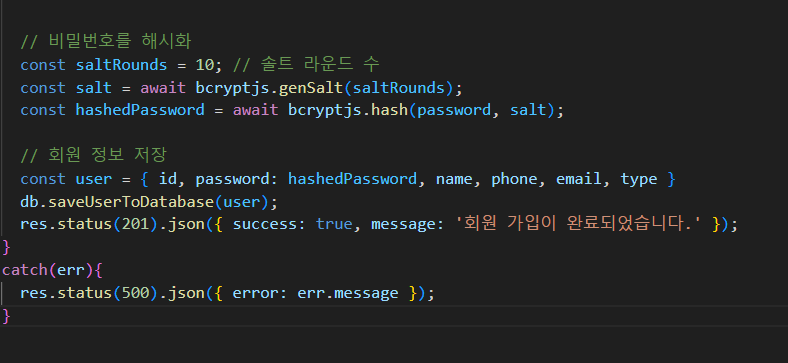

    - 해싱을 통한 비밀번호 저장
- **로그인 기능**

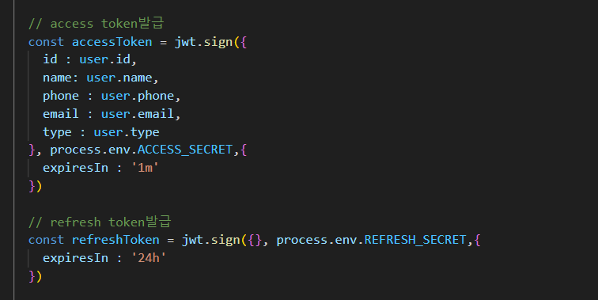

    - JWT 토큰을 활용한 로그인 기능 구현
- **예약 기능**

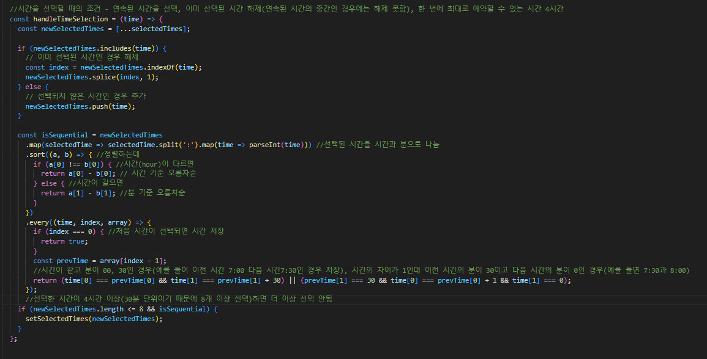

    - 30분 단위로 시간 선택, 최대 시간 4시간 예약 가능
    - 본인 예약 내역 및 승인 또는 거절 사유 확인 가능한 마이페이지 구현

- **관리자 기능**

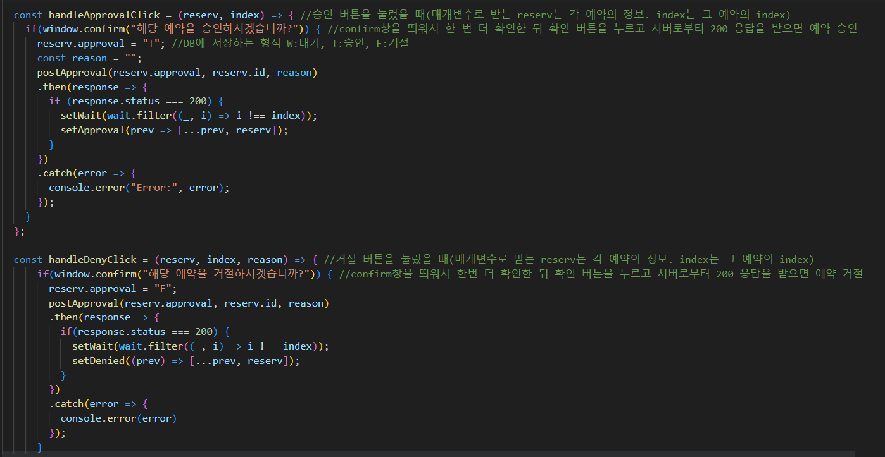

    - 예약 승인 및 예약 거절 기능 구현
    - 예약 거절 시 예약 거절 사유 작성 기능 구현

- **편의 기능**

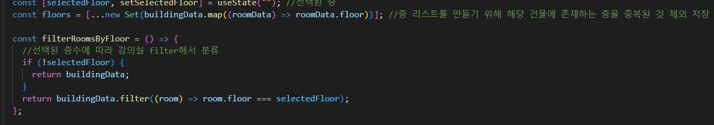

    - 편리한 UX를 위한 강의실 리스트 층별 분리 기능 구현
    - 건물 위치를 쉽게 알 수 있도록 캠퍼스 맵 페이지 리스트 구현
<br>

# Team members

2023-1 오픈소스소프트웨어 프로젝트 5조 Prodigy_Project 팀

| Role  | Name | Skills |
| :-----: |:----:| ------ |
| Frontend  | [김유리](https://github.com/yurik1m) |    |
| Backend   | [홍범선](https://github.com/bshong12)|    |
| DBA  | [홍서이](https://github.com/hongseoi) |      |

*이름 클릭 시 개인 github profile로 이동
<br>
<br>

# 프로젝트 실행 모습

토글 클릭시 프로젝트 실행 모습을 확인하실 수 있습니다.

<details>
<summary> Desktop Pages </summary>
<div>

**로그인 페이지**

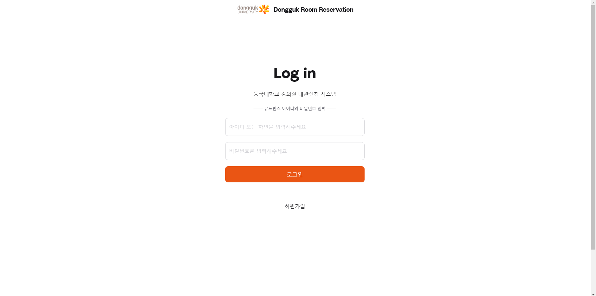

- 학번, 비밀번호를 입력하여 사이트에 로그인 할 수 있습니다.
- 로그인은 JWT 토큰을 이용하여 구현하였습니다.


**회원가입 페이지**
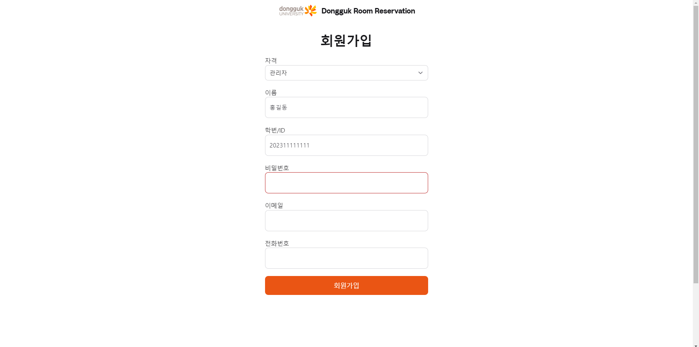

- 새 계정을 생성할 수 있습니다.
- 생성된 계정은 데이터베이스에 저장됩니다.

**예약일 선택 및 건물 선택**


- datepicker를 이용해 원하는 예약일을 선택하고 예약을 원하는 건물을 선택할 수 있습니다.

**건물 내 강의실 선택**
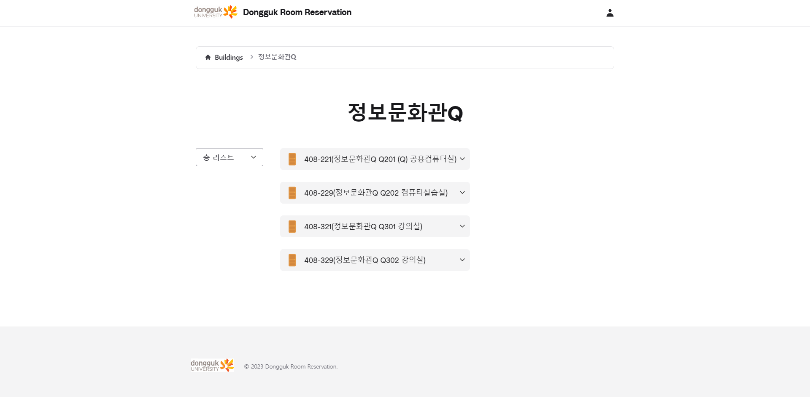

- 선택한 건물의 예약가능한 강의실을 보여줍니다. 토글 형태로 강의실 정보를 보여줍니다.

**예약 폼 작성**

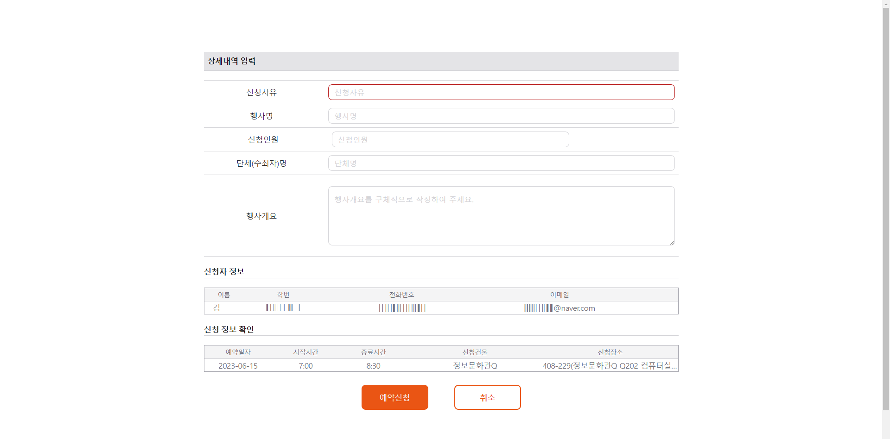

- 원하는 예약 시간을 선택하고 예약 폼을 작성하여 예약을 신청할 수 있습니다.

**관리자 페이지**
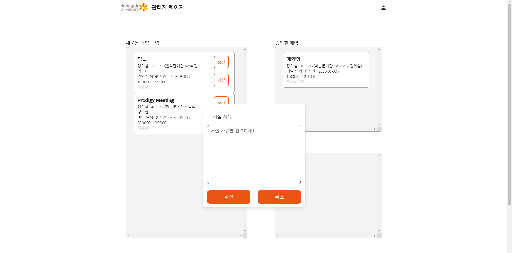


- 관리자가 이용자의 예약 신청 내역을 확인하고 예약에 대해서 승인 혹은 거절할 수 있습니다. 

**마이 페이지**
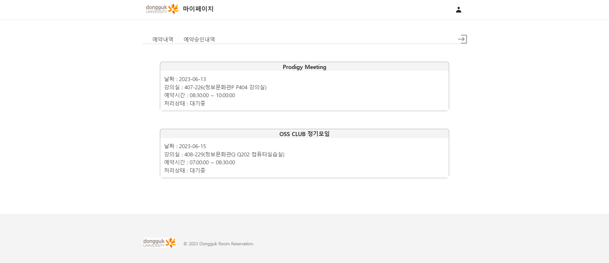

- 이용자(학생)이 본인이 예약한 예약 내역을 확인할 수 있습니다.

</div>
</details>

<details>
<summary> Mobile Pages </summary>
<div>

**로그인 페이지**

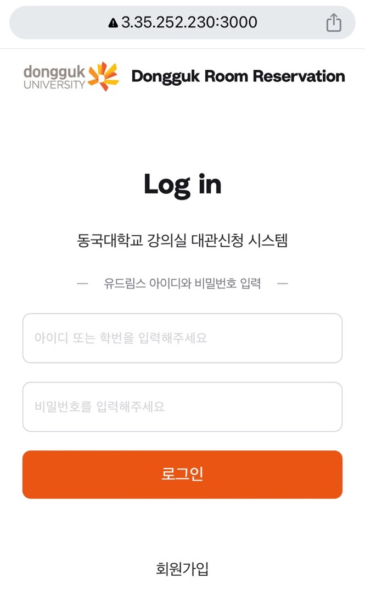


- 학번, 비밀번호를 입력하여 사이트에 로그인 할 수 있습니다.
- 로그인은 JWT 토큰을 이용하여 구현하였습니다.


**예약일 선택 및 건물 선택**

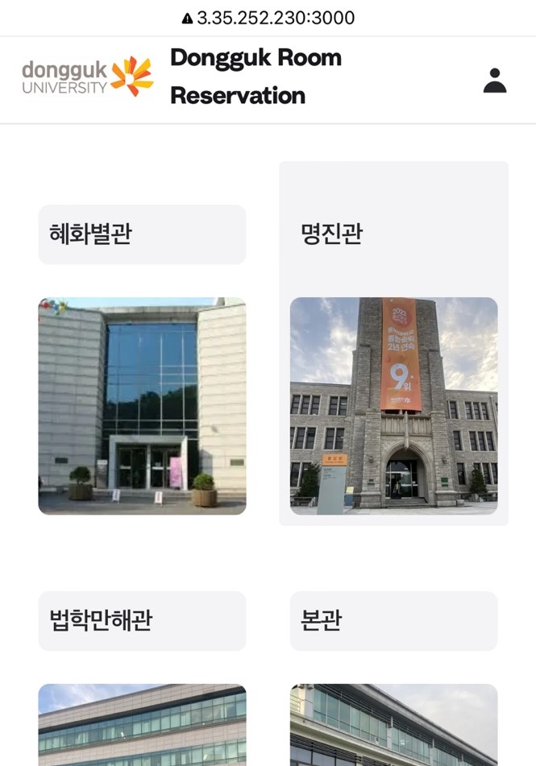

- datepicker를 이용해 원하는 예약일을 선택하고 예약을 원하는 건물을 선택할 수 있습니다.

**건물 내 강의실 선택**

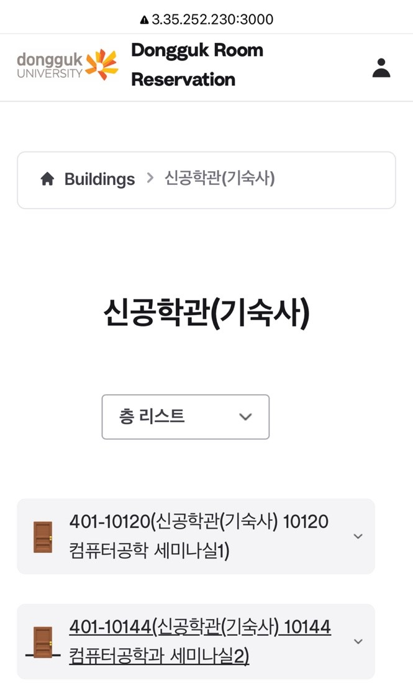

- 선택한 건물의 예약가능한 강의실을 보여줍니다. 토글 형태로 강의실 정보를 보여줍니다.

**예약 폼 작성**

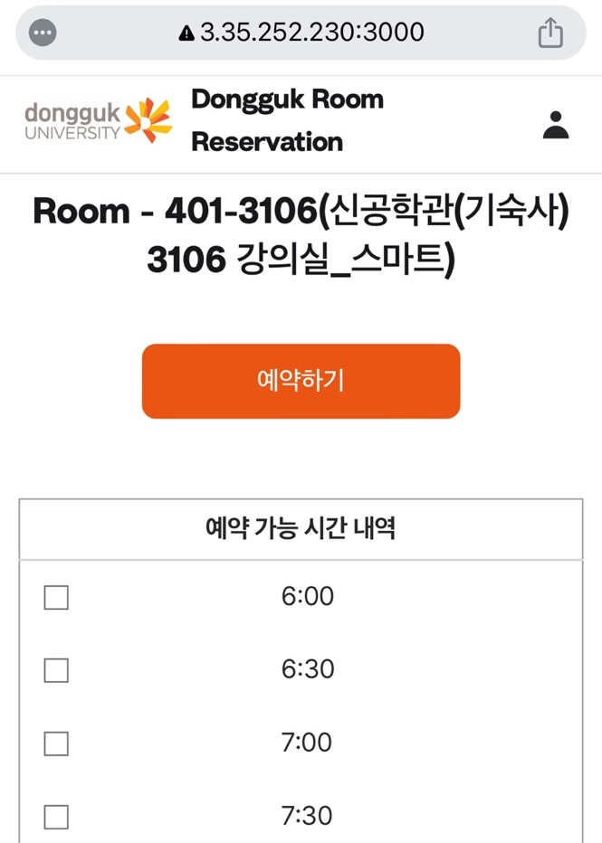  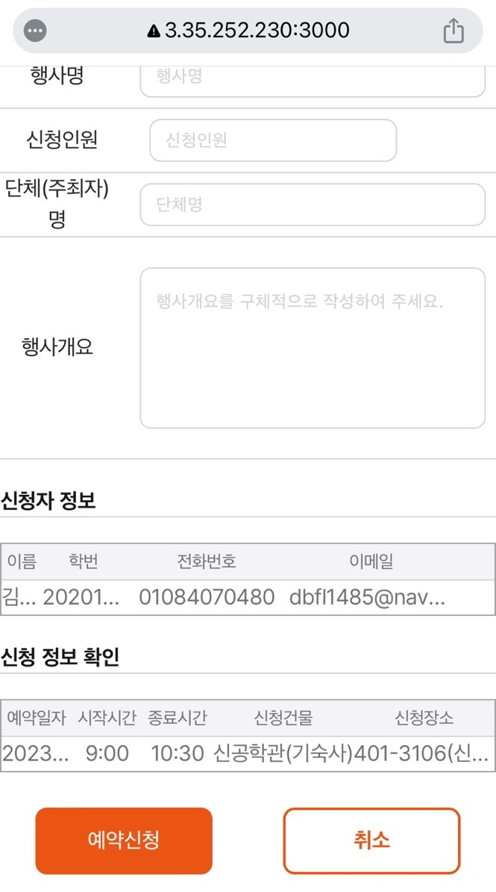 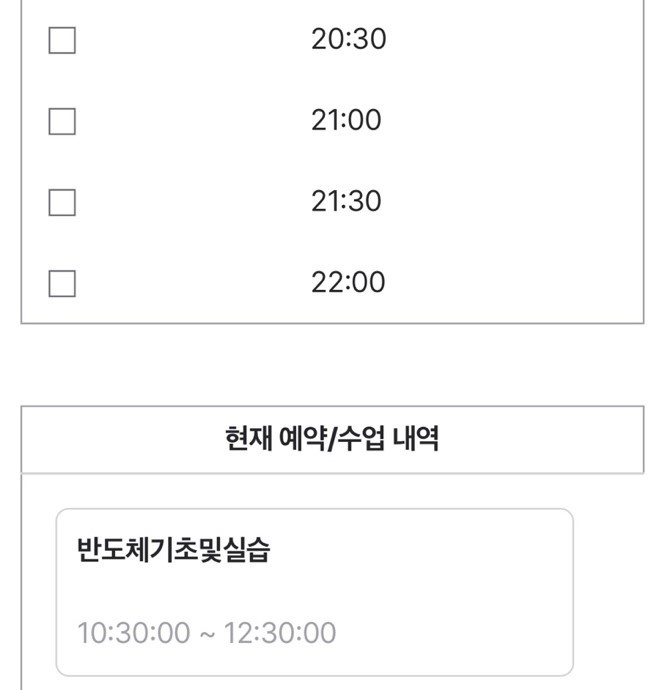


- 원하는 예약 시간을 선택하고 예약 폼을 작성하여 예약을 신청할 수 있습니다.


</div>
</details>

<br>

# Project Structure

```
└─📂Back-End # 백엔드 관련 파일들
    ├─📂controllers # 라우팅 관련 모듈 
        ├─📃buildings.js    # 건물 목록 전송
        ├─📃login.js        # 로그인(토큰 생성)
        ├─📃logout.js       # 로그아웃(토큰 삭제)
        ├─📃mypage.js       # 마이페이지 및 관리자모드 페이지
        ├─📃reservation.js  # 수업과 예약 시간 클라이언트로 전송 및 작성한 예약정보 db저장
        ├─📃rooms.js        # 강의실 목록 전송
        └─📃signup.js       # 회원가입
    ├─📂DB
        └─📃db.js # 데이터베이스에서 데이터 SELECT, INSERT 하는 함수 정의
    ├─📂services    
        ├─📃auth.js         # 토큰인증 및 재발급 
        ├─📃reservation.js  # 선택된 날짜와 강의실에 있는 수업과 예약 시간 불러오기
        └─📃rooms.js        # 건물에 해당하는 강의실 목록
    └─📃server.js       # 라우팅 경로 설정 및 서버 실행 파일

└─📂Documents   # 문서 및 데이터베이스 관련 파일들
    └─📂DB
        ├─📂Backup  # MySQL sql 백업 파일들
        ├─📂Data    # 파이썬 데이터전처리 관련 파일들
        └─📃OSSProj_데이터베이스 설계도
    ├─📂Final Announcement # 최종발표 파일들
    ├─📂Interim Announcement    # 중간발표 파일들
    ├─📂Proceddings # 회의록 파일들
    └─📂Propossal   # 제안서 파일들
   
└─📂Front-End
    ├─📂components # 컴포넌트들 정의
    ├─📂layouts # 페이지에 공통적으로 사용된 레이아웃 미리 정의
    └─📂pages
        └─📂buildings 
            └─📂[building] # nextjs의 동적인 페이지 이동을 위한 폴더명
                └─📂[room]
                    ├─📃index.jsx # 예약 시간 선택 페이지
                    └─📃reserve.jsx # 예약 폼 페이지
                └─📃index.jsx # 선택한 건물의 강의실 리스트 페이지
            ├─📃index.jsx # 건물 페이지
            └─📃campusmap.jsx # 캠퍼스맵 페이지
        ├─📂mypage # 학생 유저의 마이페이지
        ├─📂signup # 회원가입 페이지
        ├─📃index.jsx # 로그인 페이지
        └─📃manage.jsx # 관리자 페이지
    ├─📂primitives # 라이브러리 기반 컴포넌트 정의
    ├─📂public # 이미지 및 리소스 저장
    ├─📂redux # 리덕스 스토어
    └─📂utils # 데이터 및 api 설정

```

<br>

# How to Run

1. 프로젝트를 클론합니다.
```
git clone https://github.com/CSID-DGU/2023-1-OSSProj-ProdigyProject-5.git
```


2. ./Documents/DB 위치의 230605.sql 파일을 다운로드하고 MySQL 데이터베이스에 백업합니다.
3. Back-End 폴더에 .env파일을 생성하고 ACCESS_SECRET와 REFRESH_SECRET 값을 작성(토큰 암호화에 사용)
4. 터미널에서 프로젝트 루트 디렉토리로 이동하고 아래 명령어를 실행합니다.

 ```
 cd ./Back-End
 npm install
 node server

 cd ./Front-End
 yarn install
 yarn dev
 ```

5. http://localhost:3000 주소에서 실행된 프로젝트를 확인할 수 있습니다.

<br>

# References
- https://github.com/cs50victor/cu-rooms
- https://github.com/CSID-DGU/2022-2-OSSProj-You_are_webcome-9

